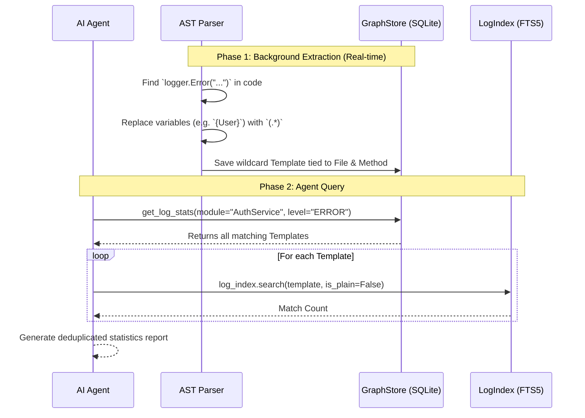

# Get Log Stats Workflow & Architecture (Universal Log Profiler)

The `get_log_stats` tool represents a paradigm shift in debugging. Rather than searching raw log files for the word `[ERROR]` and being overwhelmed by 10,000 duplicated stack traces, this tool **reads the source code first to discover exactly what *could* go wrong**, and then cross-references those discoveries against the log files to generate safe, token-efficient statistics.

## System Architecture

This tool combines the AST Parser (Tree-Sitter), the SQLite Knowledge Graph, and the FTS5 Log Database into a single, unified profiling pipeline.

## Step-by-Step Execution Flow

### 1. Abstract Syntax Tree (AST) Extraction
During the standard codebase indexing phase, the Tree-Sitter parser identifies any `invocation_expression` related to logging (e.g., `LogInformation`, `File.AppendAllText`, `Console.WriteLine`). 

It analyzes the arguments passed to those loggers. If it detects dynamic interpolated strings (e.g., `$"User {userId} failed"`), it automatically strips out the dynamic variables and replaces them with a regex wildcard `(.*)`.

### 2. Knowledge Graph Registration
The AST Parser registers these clean, regex-ready templates into the `log_templates` table in SQLite, explicitly linking them to the exact file path and method name they originated from.

### 3. Agent Execution
The AI Agent executes `get_log_stats` using powerful filters:
- `module`: Allows the agent to isolate stats to a specific file (e.g., `Program.cs`) or class (e.g., `DatabaseService`).
- `level`: Allows the agent to isolate severity (e.g., `ERROR`, `INFO`).

### 4. Mathematical Deduplication
The tool pulls the registered templates from SQLite and executes a Regex search against the `log_index.db`. Because it uses the wildcard templates rather than raw log lines, **it automatically groups logs together regardless of unique timestamps or dynamic variables**.

### 5. Insight Delivery
The tool returns a hyper-condensed summary proving exactly which features are active, which are dormant, and which are currently crashing, fully linked back to their origin in the codebase!

## Core Files Involved
- `src/liteagent/insight/indexer/ast_parser.py`: Extracts the string templates and determines severity levels.
- `src/liteagent/insight/indexer/graph_store.py`: Houses the `log_templates` SQLite table.
- `src/liteagent/insight/agent.py`: Executes the cross-reference querying logic and generates the final output string.
