# Get Project Map Workflow & Architecture

The `get_project_map` tool gives the AI Agent spatial awareness. Instead of blindly guessing file paths or dumping massive, token-heavy full-project file trees, it allows the agent to progressively "walk" through directories like a developer using a terminal.

## System Architecture

The architecture is extremely lightweight, interacting directly with the host OS file system securely via Python's `pathlib`.

```mermaid
sequenceDiagram
    participant A as AI Agent
    participant PM as Tool (get_project_map)
    participant OS as Operating System

    A->>PM: get_project_map("src/controllers")
    
    rect rgb(30, 40, 60)
        Note over PM, OS: Path Resolution
        PM->>OS: Validate path exists & is a directory
        OS-->>PM: True
    end
    
    rect rgb(40, 60, 40)
        Note over PM, OS: Directory Iteration
        PM->>OS: os.iterdir()
        OS-->>PM: Return immediate children
        loop Over Children
            PM->>PM: Check if DIR or FILE
            PM->>PM: Append to List
        end
    end
    
    PM->>PM: Sort Alphabetically
    PM-->>A: Return formatted string
```



## Step-by-Step Execution Flow

### 1. The Request Trigger
The AI agent needs to locate a specific module but doesn't know the exact file name. It calls `get_project_map` passing a relative path (e.g., `.` for root, or `src/liteagent` to dig deeper).

### 2. Security & Validation
The tool resolves the path relative to the active `project_dir`. It first checks if the path physically exists. If it doesn't, or if the path points directly to a file instead of a folder, it instantly returns an error string to the agent so the agent can self-correct.

### 3. Shallow Iteration
The tool uses `iterdir()` to scan the folder. It intentionally uses a shallow scan (Depth-1) rather than a recursive scan (like `rglob`). This is a critical design choice to prevent token-overflows in the LLM's context window.

### 4. Categorization
As it iterates over the children, it flags each item as either a directory (`[DIR ]`) or a file (`[FILE]`).

### 5. Agent Delivery
The items are sorted alphabetically for readability and assembled into a clean, text-based list:
```text
[DIR ] controllers
[DIR ] models
[FILE] config.json
[FILE] server.py
```
This is returned to the agent, allowing it to decide if it needs to `search_code`, view a file, or `get_project_map` deeper into one of the returned directories.

## Core Files Involved
- `src/liteagent/insight/agent.py`: Contains the inline implementation of the `get_project_map` function, directly utilizing Python's `pathlib` for secure file system traversal.
