# Search Code Workflow & Architecture

The `search_code` tool is the foundation of the Insight Engine. It allows the AI Agent to dynamically find functions, classes, and configuration files across the user's project, even if the agent doesn't know the exact file name or variable naming convention.

## System Architecture

The architecture uses a **Hybrid Retrieval Model** to get the best of both worlds: Semantic Vector search for meaning, and SQLite for structured metadata.

```mermaid
sequenceDiagram
    participant A as AI Agent
    participant R as HybridRetriever
    participant C as ChromaDB (Vector)
    participant S as SQLite (Metadata)

    A->>R: search_code("ValidateToken logic", top_k=3)
    
    rect rgb(30, 40, 60)
        Note over R, C: Phase 1: Semantic Search
        R->>C: Generate Embedding via all-MiniLM-L6-v2
        C-->>R: Return top K related IDs (e.g., 'method.ValidateToken')
    end
    
    alt If ChromaDB successful
        rect rgb(40, 60, 40)
            Note over R, S: Phase 2: Metadata Hydration
            R->>S: SELECT file_path, source_code WHERE id IN (...)
            S-->>R: Return exact source code blocks
        end
    else If ChromaDB fails / Empty
        rect rgb(60, 40, 40)
            Note over R, S: Phase 2 Fallback: Sparse Search
            R->>S: SELECT ... WHERE source_code LIKE '%ValidateToken%'
            S-->>R: Return hard keyword matches
        end
    end
    
    R-->>A: Format & Return clean Markdown results
```



## Step-by-Step Execution Flow

### 1. The Request Trigger
The AI agent decides it needs to view code based on a conversational prompt (e.g., the user asks *"How are tokens validated?"*). The agent independently calls the `search_code` tool, passing in its best semantic query.

### 2. Semantic Vector Embedding
The query is received by the `HybridRetriever`. The retriever immediately passes the raw text to the `SentenceTransformer` model (`all-MiniLM-L6-v2`). The model converts the text query into a dense mathematical vector consisting of 384 dimensions.

### 3. ChromaDB Similarity Search
The vector is sent to the local `ChromaDB` instance, querying the `code_symbols` collection. ChromaDB mathematically compares the query vector against all the code snippet vectors that were generated during the initial `ASTParser` background sync using Cosine Similarity. It returns a list of the top `K` most semantically similar IDs.

### 4. SQLite Metadata Hydration
Because vector databases are highly inefficient at storing long-form structural data, the `HybridRetriever` takes the list of winning IDs and queries the local **SQLite Knowledge Graph** (`knowledge.db`). It grabs the exact `file_path`, precise `source_code` block, and `symbol_name` for each ID simultaneously.

### 5. Sparse Keyword Fallback (Fail-safe)
If the ChromaDB vector search fails (e.g., model failed to download), or if it returns 0 results, the system gracefully degrades to a sparse SQLite keyword search. It breaks the query into individual words and uses SQL `LIKE` statements to find hard substring matches in the code.

### 6. Agent Delivery
The final, hydrated results are formatted into a clean, readable string block:
```text
File: D:\project\Program.cs
Symbol: ValidateToken
Code:
public bool ValidateToken(...) { ... }
---
```
This text is handed back to the AI Agent so it can read the code and formulate a response to the user.

## Core Files Involved
- `src/liteagent/insight/retrieval/retriever.py`: Contains the `HybridRetriever` class that manages the ChromaDB fallback to SQLite logic.
- `src/liteagent/insight/indexer/ast_parser.py`: Handles the background indexing of the code into ChromaDB so it is ready for retrieval.
