# Search Logs Workflow & Architecture

The `search_logs` tool acts as the AI Agent's real-time "Observability" mechanism. It allows the agent to rip through massive application log files to find specific trace IDs, error codes, or debug statements quickly without overwhelming its context window.

## System Architecture

Unlike the code search, log search relies on **High-Speed File Streaming** rather than vector embeddings. This is because production applications can generate thousands of logs a minute, and vectorizing every mundane log line would cause massive CPU bottlenecks.

```mermaid
sequenceDiagram
    participant A as AI Agent
    participant L as LogIndex
    participant F as File System (app.log)

    A->>L: search_logs("Connection reset", is_plain=True)
    
    rect rgb(30, 40, 60)
        Note over L, F: Phase 1: Stream Initialization
        L->>F: Open stream in Read-Only mode
        F-->>L: File Handle
    end
    
    rect rgb(40, 60, 40)
        Note over L, F: Phase 2: Reverse Scan
        loop Over lines bottom-up (newest first)
            L->>F: Read Line
            alt If query in line
                L->>L: Parse Timestamp & Level
                L->>L: Append to Results
            end
            
            alt If Results >= limit (50)
                L->>L: Break Loop Early
            end
        end
    end
    
    L-->>A: Format & Return structured Log List
```



## Step-by-Step Execution Flow

### 1. The Request Trigger
The AI agent determines it needs to see exact log lines to diagnose a crash (e.g., the user asks *"Why did user 542 fail to connect?"*). The agent autonomously calls the `search_logs` tool with a specific keyword query.

### 2. File Stream Ingestion
The query is passed down to the `LogIndex` component. Instead of executing an expensive semantic search, the `LogIndex` securely opens the target `.log` file (e.g., `app.log`) and begins streaming it into memory.

### 3. Reverse Chronological Search
Because developers almost always care about the *most recent* logs when debugging, the `LogIndex` reads the file stream from the bottom-up (in reverse order). This guarantees that the first results found are the most historically relevant to the current crash.

### 4. Exact Keyword/Regex Filtering
As it scans backwards, it executes a highly optimized hard-string match (`if query in line`). 
- **Standard Search:** If `is_plain=True`, it looks for exact substrings.
- **Regex Search:** If `is_plain=False` is requested by the agent, it can execute complex Python Regular Expressions directly against the raw log lines (e.g., `r"Error [0-9]{3}"`).

### 5. Data Extraction & Formatting
When a line matches the filter, the engine parses out the components of the standard log format. It extracts the `[TIMESTAMP]`, the `[LEVEL]` (e.g., ERROR, INFO), and the actual message. It appends this structured data to an internal result list.

### 6. Fast-Fail Boundary (The Limit)
To prevent overwhelming the AI agent's context window (which could cause the LLM to crash or hallucinate), the loop automatically breaks the moment the result `limit` (default 50) is reached. 

### 7. Agent Delivery
The structured logs are assembled into a clean chronological list:
```text
[2026-05-24T18:00:00Z] ERROR - app.log - Connection reset by peer
[2026-05-24T18:00:01Z] ERROR - app.log - Retry failed
```
This list is returned to the AI Agent so it can diagnose the issue.

## Core Files Involved
- `src/liteagent/insight/logs/log_index.py`: Handles the high-speed file reading, reverse iteration, and log filtering logic.
- `src/liteagent/insight/agent.py`: Exposes the tool interface and parameters to the LangGraph agent.
