# Trace Calls Workflow & Architecture

The `trace_calls` tool acts as the AI Agent's X-ray vision for the codebase. It allows the agent to traverse the application's execution graph, meaning it can answer complex architectural questions like *"If I change this database function, what upstream controllers will break?"*

## System Architecture

The tool relies heavily on a pre-computed **SQLite Knowledge Graph** that was generated by the Tree-Sitter AST Parser, coupled with a Breadth-First Search (BFS) graph traversal algorithm.

```mermaid
sequenceDiagram
    participant A as AI Agent
    participant GS as GraphStore
    participant S as SQLite (Knowledge Graph)

    A->>GS: trace_calls("ValidateToken", direction="callers", depth=3)
    
    rect rgb(30, 40, 60)
        Note over GS, S: Recursive BFS Traversal
        GS->>GS: Initialize Queue with [("ValidateToken", 0)]
        loop While Queue not empty & depth < 3
            GS->>S: SELECT source FROM relationships WHERE target = current_node
            S-->>GS: Return immediate callers (e.g., ProcessNextBatch)
            GS->>GS: Add callers to Queue & Visited Set
        end
    end
    
    GS-->>A: Format & Return JSON Graph Map
```

## Step-by-Step Execution Flow

### 1. The Request Trigger
The AI agent needs to understand the impact of a function. It calls `trace_calls` passing in the exact `symbol` it wants to inspect, the `direction` (`callers` or `callees`), and how deep the trace should go (`depth`).

### 2. Queue Initialization
The `GraphStore` receives the request and spins up a Breadth-First Search (BFS) algorithm. It initializes a `visited` set to prevent infinite circular loops (e.g., recursive functions) and pushes the starting symbol into the queue at `depth = 0`.

### 3. SQLite Traversal Loop
The system dequeues the first item and executes a lightning-fast SQL query against the `relationships` table. 
- If `direction="callers"`, it asks: *"Who has this symbol as their target?"*
- If `direction="callees"`, it asks: *"What targets does this symbol use?"*

### 4. Recursive Discovery
For every new node discovered in the SQL results, the system checks if it has been visited before. If not, it is added to the results list and pushed back into the queue with its `depth` incremented by 1. The loop continues until the queue is empty or the requested `depth` is reached.

### 5. Agent Delivery
The total graph path is bundled into a clean JSON object containing the `symbol`, the `depth` traversed, and a list of all identified `callers` and `callees`. This is returned to the AI Agent so it can map out the impact radius.

## Core Files Involved
- `src/liteagent/insight/indexer/graph_store.py`: Houses the Breadth-First Search graph algorithm and executes the SQLite queries.
- `src/liteagent/insight/agent.py`: Exposes the `trace_calls` tool to the LangGraph agent.
