# Trace Log to Code Workflow & Architecture

The `trace_log_to_code` tool is the ultimate bridge between production logs and source code. Instead of the AI Agent manually grepping the entire codebase to guess where a log came from, this tool uses mathematical Regex mapping to instantly trace any log line back to its exact originating function and file.

## System Architecture

The architecture builds upon the AST Extracted Templates system created for `get_log_stats`.

```mermaid
sequenceDiagram
    participant A as AI Agent
    participant TC as trace_log_to_code
    participant GS as GraphStore (SQLite)
    participant AST as AST Parser

    Note over GS, AST: Log Templates already extracted & stored
    
    A->>TC: trace_log_to_code("User 123 performed action login")
    
    TC->>GS: SELECT * FROM log_templates
    GS-->>TC: Returns [..., "User (.*?) performed action (.*?)", ...]
    
    rect rgb(30, 40, 60)
        Note over TC, GS: Regex Matching Engine
        TC->>TC: re.search(template, "User 123 performed action login")
        TC-->>TC: Match Found! (File: Program.cs, Method: LogSpammer.Start)
    end
    
    TC->>GS: SELECT source_code FROM symbols WHERE name = 'LogSpammer.Start'
    GS-->>TC: Returns C# Code Block
    
    TC-->>A: Formatted Report (File, Method, Line Numbers, Code)
```

## Step-by-Step Execution Flow

### 1. The Input
The AI Agent is investigating a specific log line (e.g., `[ERROR] Connection reset by peer in DatabaseService`) and needs to see the code around it. It calls `trace_log_to_code(log_string)`.

### 2. Loading the Templates
The tool queries the SQLite database to retrieve all `log_templates`. These templates were created during indexing when the AST Parser stripped out dynamic `{variables}` and safely `re.escape()`'d the static strings.

### 3. Regex Matching
The tool iterates over the templates and executes a `re.search()` against the user's raw log string. Because we used the non-greedy wildcard `(.*?)` during extraction, the tool can perfectly match logs even if they contain dynamic guids, timestamps, or numerical IDs.

### 4. Source Code Retrieval
Once a match is identified, the tool extracts the `file_path` and `method_name` tied to that template. It performs a final query against the `symbols` table in SQLite to fetch the exact `start_line`, `end_line`, and `source_code`.

### 5. Graceful Fallback
If the log string fails to match *any* extracted template, the tool does not crash or hallucinate. It gracefully informs the agent: *"This log does not match any extracted templates from the codebase. It may originate from a third-party dependency..."*

## Core Files Involved
- `src/liteagent/insight/agent.py`: Houses the Regex matching loop and the agent delivery formatting.
- `src/liteagent/insight/indexer/graph_store.py`: Serves the templates and the source code snippets.
- `src/liteagent/insight/indexer/ast_parser.py`: Responsible for generating the bulletproof Regex strings using `re.escape()`.
