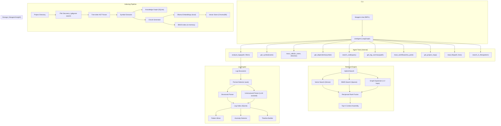

# LiteAgent Insight — Project Knowledge & Analysis Agent

> An AI agent that deeply understands **any project** it's spawned in — traces workflows, analyzes logs from running services, and answers structural questions — all using local-first, 2026 industry-grade techniques.

---

## What This Agent Actually Does (For Non-Technical Users)

Think of the Insight Agent as a senior engineer who has instantly read every line of code in your project and memorized every log file, and is now sitting next to you ready to answer questions.

### Key Deliverables
1. **Instant Codebase Understanding**: Drop the agent into any project folder (Python, C#, Javascript, etc.), and it instantly learns how the entire app is wired together.
2. **The "Log Detective"**: It reads massive, gigabyte-sized server log files in milliseconds, groups similar errors together, and highlights anomalies.
3. **Connecting Logs to Code**: If the app crashes, the agent can trace the error from the log file *directly* back to the exact line of code that caused it.
4. **Visual Flowcharts**: It can automatically draw visual maps (flowcharts) explaining how complex features work behind the scenes.

### Real-World Scenario: "The 3 AM Server Crash"

*Imagine an e-commerce website starts failing to process orders during a huge sale.*

**The Old Way (Without the Agent):**
A developer has to manually download massive log files, Ctrl+F for "error", find a cryptic message like `PAYMENT_ERR_502`, and then manually dig through hundreds of code files trying to guess which feature triggered it. This takes hours of stressful detective work.

**The New Way (With the Insight Agent):**
You open your terminal and ask:
> **You:** "Orders are failing. Find the errors from the last hour and tell me where they are coming from."

> **Agent:** "I searched the logs and found a massive spike in `PAYMENT_ERR_502` errors. I traced this error code back to your code in `PaymentProcessor.cs` on line 142. It looks like the system is timing out while trying to reach the Stripe API. Here is a flowchart of the payment execution path..."

The agent performs hours of manual searching, log parsing, and code tracing in about 5 seconds.

---
## Decisions (Locked)

| Decision | Choice | Rationale |
|----------|--------|-----------|
| **Embedding Model** | Pluggable — Gemini `text-embedding-004` (cloud, free) or Ollama `nomic-embed-text` (local) | Factory pattern: switch via `insight_embedding_provider` config. Gemini default (free tier, no Ollama needed); Ollama for fully offline/private |
| **Log Scope** | Arbitrary — any project's logs + configured external paths | Agent detects logs from the project directory it's spawned in **and** any additional directories listed in `insight_log_paths` config |
| **CLI Interface** | Integration: Upgrading `liteagent chat` | Insight tools will be injected into the existing chat agent, avoiding command fragmentation |
| **Live Updates** | Background File Watcher (`watchdog`) | `liteagent chat` runs a background thread that monitors the project folder and instantly updates the graph/index when you save a file |
| **Knowledge Graph Access** | Internal agent tools | Exposed as LangGraph tool functions, NOT MCP — keeps architecture simple |

---

## How It Works — User Flow

```
$ cd /path/to/any-project
$ liteagent chat

🔍 Initializing Insight Engine... (first run only, incremental after)
   ├── Parsed 47 files (Tree-sitter AST)
   ├── Extracted 312 symbols, 489 relationships
   ├── Embedded 156 code chunks (nomic-embed-text via Ollama)
   ├── Detected log sources: ./logs/*.log, ./storage/logs/*.log
   └── External log paths:   /var/log/myapp/*.log (from config)

💡 LiteAgent ready. I have deep knowledge of this project.

You > How does the authentication middleware work?
You > Show me the execution flow when a user logs in
You > Analyze the error logs from today — any patterns?
You > What changed between the last two sessions?
```

---

## Architecture



---

## Component 1: Code Indexing Pipeline

The foundation — parse any project into a queryable knowledge graph + vector store.

---

### [NEW] `src/liteagent/insight/__init__.py`

Package init. Exports `InsightEngine` (the main orchestrator class).

---

### [NEW] `src/liteagent/insight/indexer/__init__.py`

**Indexer orchestrator** — ties AST parsing → graph store → vector store → BM25.

```python
class ProjectIndexer:
    """Orchestrates full project indexing pipeline."""

    def index_project(self, root_dir: Path) -> IndexStats:
        """Full index — first run. Discovers files, parses ASTs, builds graph, embeds chunks."""

    def update_index(self, root_dir: Path) -> IndexStats:
        """Incremental — re-index only files changed since last run (SHA-256 hash check)."""

    def get_stats(self) -> IndexStats:
        """Returns: file_count, symbol_count, relationship_count, chunk_count, last_indexed."""

    def is_indexed(self, root_dir: Path) -> bool:
        """Check if project has been indexed before."""
```

Key behaviors:
- Respects `.gitignore` via `pathspec` library
- Skips binary files, `node_modules`, `.venv`, `__pycache__`, `.git`
- Content hashing (SHA-256) for incremental updates — only re-parses changed files
- Stores index at `{project_root}/.liteagent/insight/` (project-local, not global)

---

### [NEW] `src/liteagent/insight/indexer/ast_parser.py`

**Tree-sitter AST parser** — language-aware, deterministic symbol extraction.

```python
@dataclass
class Symbol:
    name: str
    qualified_name: str       # e.g., "module.ClassName.method_name"
    kind: str                 # "function" | "class" | "method" | "import" | "variable" | "decorator"
    file_path: str
    start_line: int
    end_line: int
    docstring: str | None
    signature: str | None     # For functions/methods: "def foo(bar: str, baz: int) -> bool"
    parent: str | None        # For methods → parent class qualified name
    source_code: str          # Raw source of this symbol
    content_hash: str         # SHA-256 of source_code
    logged_errors: list[str]  # Literal strings passed to logger.error(), etc. inside this symbol

@dataclass
class Relationship:
    source: str               # Qualified name of caller/importer
    target: str               # Qualified name of callee/imported
    kind: str                 # "calls" | "imports" | "inherits" | "decorates" | "instantiates"
    file_path: str
    line: int

class ASTParser:
    """Tree-sitter based parser with language detection."""

    SUPPORTED_LANGUAGES = {
        ".py": "python",
        ".js": "javascript",
        ".ts": "typescript",
        ".go": "go",
        ".rs": "rust",
        ".java": "java",
        ".rb": "ruby",
        ".cpp": "cpp",
        ".c": "c",
        ".cs": "c_sharp",         # C# / .NET support
    }

    def parse_file(self, file_path: Path) -> tuple[list[Symbol], list[Relationship]]:
        """Parse a single file → extract symbols and relationships."""

    def detect_language(self, file_path: Path) -> str | None:
        """Detect language from file extension."""
```

Implementation details:
- Uses `tree-sitter` Python bindings with `tree-sitter-languages` for grammar loading
- Extracts symbols via tree-sitter S-expression queries: `(function_definition)`, `(class_definition)`, `(import_statement)`
- **Logger Call Indexing**: Uses queries to find logging calls (e.g., `logger.error("...")`, `ILogger.LogError("...")` in C#) and maps the literal error strings to the enclosing function (`logged_errors`).
- Resolves relationships by matching call expressions to known symbol names
- Supports **Python first** (since LiteAgent is Python), with extensible grammar loading for other languages (including C#/.NET)
- Handles decorators, async functions, nested classes, comprehensions

---

### [NEW] `src/liteagent/insight/indexer/graph_store.py`

**SQLite knowledge graph** — stores symbols and relationships for structural queries.

```python
class KnowledgeGraph:
    """SQLite-backed code knowledge graph."""

    def __init__(self, db_path: Path):
        """Initialize with SQLite database path. Creates tables if needed."""

    # --- Write operations ---
    def upsert_file(self, path: str, content_hash: str, language: str) -> None
    def upsert_symbol(self, symbol: Symbol) -> None
    def upsert_relationship(self, rel: Relationship) -> None
    def remove_file(self, path: str) -> None  # Cascades: removes symbols + rels for this file

    # --- Read operations (exposed as agent tools) ---
    def get_symbol(self, name: str) -> Symbol | None
        """Fuzzy lookup by name or qualified name."""

    def get_callers(self, symbol_name: str) -> list[Symbol]
        """What calls this function/method?"""

    def get_callees(self, symbol_name: str) -> list[Symbol]
        """What does this function/method call?"""

    def get_class_hierarchy(self, class_name: str) -> dict
        """Inheritance tree (parents + children)."""

    def get_imports(self, file_path: str) -> list[Relationship]
        """All imports in a file."""

    def get_dependents(self, symbol_name: str) -> list[Symbol]
        """Everything that depends on this symbol (callers + importers)."""

    def trace_execution_path(self, entry: str, max_depth: int = 5) -> list[list[str]]
        """Multi-hop call graph traversal. Returns all paths from entry point."""

    def get_module_symbols(self, file_path: str) -> list[Symbol]
        """All symbols defined in a file."""

    def get_project_map(self) -> dict
        """High-level project structure: modules → classes → functions."""

    def get_stats(self) -> dict
```

SQLite schema:
```sql
CREATE TABLE files (
    path TEXT PRIMARY KEY,
    content_hash TEXT NOT NULL,
    language TEXT,
    last_indexed TIMESTAMP DEFAULT CURRENT_TIMESTAMP
);

CREATE TABLE symbols (
    id INTEGER PRIMARY KEY AUTOINCREMENT,
    name TEXT NOT NULL,
    qualified_name TEXT UNIQUE NOT NULL,
    kind TEXT NOT NULL,
    file_path TEXT NOT NULL REFERENCES files(path) ON DELETE CASCADE,
    start_line INTEGER,
    end_line INTEGER,
    docstring TEXT,
    signature TEXT,
    parent TEXT,
    source_code TEXT,
    content_hash TEXT,
    UNIQUE(qualified_name)
);

CREATE TABLE relationships (
    id INTEGER PRIMARY KEY AUTOINCREMENT,
    source TEXT NOT NULL,
    target TEXT NOT NULL,
    kind TEXT NOT NULL,
    file_path TEXT NOT NULL REFERENCES files(path) ON DELETE CASCADE,
    line INTEGER,
    UNIQUE(source, target, kind, file_path, line)
);

-- Indexes for fast traversal
CREATE INDEX idx_symbols_name ON symbols(name);
CREATE INDEX idx_symbols_file ON symbols(file_path);
CREATE INDEX idx_symbols_kind ON symbols(kind);
CREATE INDEX idx_rel_source ON relationships(source);
CREATE INDEX idx_rel_target ON relationships(target);
CREATE INDEX idx_rel_kind ON relationships(kind);
```

---

### [NEW] `src/liteagent/insight/indexer/vector_store.py`

**ChromaDB vector store** — semantic code search with pluggable embeddings.

```python
class CodeVectorStore:
    """ChromaDB-backed vector store with pluggable embedding provider."""

    def __init__(self, persist_dir: Path, embedding_provider: EmbeddingProvider):
        """Initialize ChromaDB with persistent storage + injected embedding provider."""

    def add_chunks(self, chunks: list[CodeChunk]) -> None
        """Embed and store code chunks. Each chunk = one symbol with metadata."""

    def search(self, query: str, top_k: int = 20, filters: dict | None = None) -> list[SearchResult]
        """Semantic search. Filters: {kind: "function", file_path: "src/..."}."""

    def delete_file_chunks(self, file_path: str) -> None
        """Remove all chunks from a specific file (for re-indexing)."""

    def count(self) -> int

@dataclass
class CodeChunk:
    id: str                   # Qualified name or unique ID
    content: str              # Source code + enriched context
    metadata: dict            # file_path, symbol_name, kind, language, imports, docstring

@dataclass
class SearchResult:
    chunk: CodeChunk
    score: float
    distance: float
```

Chunk construction strategy:
- One chunk per symbol (function, class, method)
- Each chunk is **enriched** with context:
  ```
  # File: src/liteagent/graph/nodes/executor.py
  # Module: liteagent.graph.nodes.executor
  # Imports: typing, pathlib, ...
  # Class: None (module-level function)

  async def executor_node(state: AgentState) -> AgentState:
      """Execute tool calls from the planner..."""
      ...
  ```
- Embedding via the configured `EmbeddingProvider` (Gemini cloud or Ollama local)

---

### [NEW] `src/liteagent/insight/indexer/embeddings.py`

**Pluggable embedding system** — factory pattern with protocol-based providers.

```python
from typing import Protocol, runtime_checkable


@runtime_checkable
class EmbeddingProvider(Protocol):
    """Protocol for embedding providers. Implement this to add new backends."""

    @property
    def dimensions(self) -> int:
        """Embedding vector dimensionality (e.g., 768, 1536)."""
        ...

    @property
    def provider_name(self) -> str:
        """Human-readable provider name for logging/display."""
        ...

    async def embed(self, texts: list[str]) -> list[list[float]]:
        """Batch embed texts. Handles chunking/rate-limiting internally."""
        ...

    async def embed_single(self, text: str) -> list[float]:
        """Embed a single text. Convenience wrapper around embed()."""
        ...


class GeminiEmbeddingProvider:
    """
    Free cloud embeddings via Google Gemini API.

    Model: text-embedding-004 (768 dimensions, 2048 token input)
    Free tier: 1500 RPM — more than enough for project-scale indexing.
    Requires: GEMINI_API_KEY env var (same key used for LLM).
    """

    def __init__(self, model: str = "text-embedding-004", api_key: str | None = None):
        self.model = model
        self.api_key = api_key or os.environ.get("GEMINI_API_KEY")
        if not self.api_key:
            raise ValueError("GEMINI_API_KEY required for Gemini embeddings")

    @property
    def dimensions(self) -> int:
        return 768

    @property
    def provider_name(self) -> str:
        return f"gemini ({self.model})"

    async def embed(self, texts: list[str]) -> list[list[float]]:
        """Batch embed via google-genai SDK. Auto-chunks to respect API limits."""

    async def embed_single(self, text: str) -> list[float]:
        """Embed a single text."""


class OllamaEmbeddingProvider:
    """
    Local embedding generation via Ollama.

    Model: nomic-embed-text (768 dims, 8192 token context) or bge-m3.
    Fully offline — no API key needed.
    Requires: Ollama running locally (http://localhost:11434).
    """

    def __init__(self, model: str = "nomic-embed-text", base_url: str = "http://localhost:11434"):
        self.model = model
        self.base_url = base_url

    @property
    def dimensions(self) -> int:
        return 768  # nomic-embed-text default; bge-m3 = 1024

    @property
    def provider_name(self) -> str:
        return f"ollama ({self.model})"

    async def embed(self, texts: list[str]) -> list[list[float]]:
        """Batch embed texts via Ollama /api/embed endpoint."""

    async def embed_single(self, text: str) -> list[float]:
        """Embed a single text."""


def create_embedding_provider(
    provider: str = "gemini",
    model: str | None = None,
    **kwargs,
) -> EmbeddingProvider:
    """
    Factory function — creates the right embedding provider from config.

    Args:
        provider: "gemini" (default, free cloud) or "ollama" (local).
        model: Override default model. If None, uses provider's default.
        **kwargs: Provider-specific args (e.g., base_url for Ollama, api_key for Gemini).

    Usage:
        # From config (typical)
        provider = create_embedding_provider(
            provider=config.insight_embedding_provider,
            model=config.insight_embedding_model,
        )

        # Quick switch
        provider = create_embedding_provider("ollama")  # local
        provider = create_embedding_provider("gemini")  # cloud

    Raises:
        ValueError: If provider name is not recognized.
    """
    providers = {
        "gemini": GeminiEmbeddingProvider,
        "ollama": OllamaEmbeddingProvider,
    }
    if provider not in providers:
        raise ValueError(f"Unknown embedding provider '{provider}'. Choose from: {list(providers.keys())}")

    cls = providers[provider]
    return cls(model=model, **kwargs) if model else cls(**kwargs)
```

Key design decisions:
- **Protocol, not ABC** — duck-typing friendly, easy to add new providers without inheritance
- **Factory function, not class** — simple, no state; just maps config string → instance
- **Provider-specific defaults** — each provider knows its own default model
- **Shared interface** — `CodeVectorStore` depends only on `EmbeddingProvider`, never on a concrete class

---

## Component 2: Hybrid Retrieval Engine

Combines vector search + BM25 + graph traversal for high-quality code retrieval.

---

### [NEW] `src/liteagent/insight/retrieval/__init__.py`

### [NEW] `src/liteagent/insight/retrieval/retriever.py`

**Hybrid retrieval engine** — the 2026 "VectorCypher" pattern.

```
User Query → [Vector Search] ──┐
             [BM25 Search]  ───┤──→ [Reciprocal Rank Fusion] → Top-K Results
             [Graph Expand]  ──┘
```

```python
class HybridRetriever:
    """Combines dense vector, sparse BM25, and graph-based retrieval."""

    def __init__(self, vector_store: CodeVectorStore, bm25: BM25Index, graph: KnowledgeGraph):
        ...

    def retrieve(self, query: str, top_k: int = 8) -> list[RetrievalResult]:
        """
        Full hybrid retrieval pipeline:
        1. Vector search → top-20 candidates (semantic similarity)
        2. BM25 search → top-20 candidates (exact symbol/keyword match)
        3. Graph expansion → for top hits, pull 1-2 hop neighbors (callers/callees)
        4. Reciprocal Rank Fusion → merge all results
        5. Return top-K with assembled context
        """

    def _reciprocal_rank_fusion(self, *ranked_lists: list, k: int = 60) -> list:
        """RRF scoring: score(d) = Σ 1/(k + rank_i(d)) for each list i."""

@dataclass
class RetrievalResult:
    symbol_name: str
    file_path: str
    source_code: str
    relevance_score: float
    retrieval_source: str     # "vector" | "bm25" | "graph"
    related_symbols: list[str]  # From graph expansion
    context: str              # Enriched context string for LLM
```

---

### [NEW] `src/liteagent/insight/retrieval/bm25.py`

**BM25 sparse index** — catches exact symbol names that vector search misses.

```python
class BM25Index:
    """In-memory BM25 index for code-aware keyword search."""

    def __init__(self):
        self.index = None
        self.chunks = []

    def build(self, chunks: list[CodeChunk]) -> None:
        """Build BM25 index. Tokenizes with code-aware splitter."""

    def search(self, query: str, top_k: int = 20) -> list[tuple[CodeChunk, float]]:
        """BM25 ranked search."""

    def _tokenize(self, text: str) -> list[str]:
        """Code-aware tokenizer: splits on snake_case, CamelCase, dots, operators."""
```

---

## Component 3: Universal Log Analysis Engine

Discovers, parses, and analyzes logs from **any project** — not just LiteAgent's own logs.

---

### [NEW] `src/liteagent/insight/logs/__init__.py`

### [NEW] `src/liteagent/insight/logs/discoverer.py`

**Log file auto-discovery** — finds log files in the project directory **and** configured external paths.

```python
class LogDiscoverer:
    """Auto-discovers log files in a project directory and external configured paths."""

    COMMON_LOG_PATTERNS = [
        "*.log",
        "logs/**/*.log",
        "log/**/*.log",
        "storage/logs/**/*.log",   # Laravel
        "var/log/**/*.log",        # Symfony
        "tmp/logs/**/*",
        "*.log.*",                 # Rotated logs
        "output/*.log",
        "debug.log",
        "error.log",
        "access.log",
    ]

    COMMON_LOG_DIRS = [
        "logs", "log", "storage/logs", "var/log", "tmp",
        ".liteagent",  # LiteAgent's own logs
    ]

    def __init__(self, extra_log_paths: list[str] | None = None):
        """
        Args:
            extra_log_paths: Additional absolute directory paths or glob patterns
                             to scan for logs (from config `insight_log_paths`).
                             Supports both directories and glob patterns:
                               - "/var/log/myapp"         → scans entire directory
                               - "/var/log/myapp/*.log"   → matches specific pattern
                               - "D:\\Logs\\service"      → Windows paths supported
        """
        self.extra_log_paths = extra_log_paths or []

    def discover(self, root_dir: Path) -> list[LogSource]:
        """
        Scan for log files. Returns discovered sources with metadata.

        Discovery order:
        1. Scan root_dir using COMMON_LOG_PATTERNS and COMMON_LOG_DIRS
        2. Scan each path in self.extra_log_paths:
           - If path is a directory → apply COMMON_LOG_PATTERNS within it
           - If path is a glob pattern → resolve and collect matching files
           - If path is a single file → include directly
        3. Deduplicate by resolved absolute path (handles symlinks)
        4. Return merged list sorted by last_modified (newest first)
        """

    def watch(self, root_dir: Path) -> AsyncIterator[LogEvent]:
        """Watch for new log entries in real-time (tail -f equivalent).
        Watches both project-local and configured external log sources."""

@dataclass
class LogSource:
    path: Path
    size_bytes: int
    last_modified: datetime
    format_hint: str          # "structured" | "unstructured" | "json" | "liteagent" | "unknown"
    line_count: int
    is_external: bool         # True if discovered from insight_log_paths (not project-local)
```

---

### [NEW] `src/liteagent/insight/logs/parser.py`

**Universal log parser** — auto-detects formats, extracts error codes, and streams large files.

```python
class LogParser:
    """Multi-format log parser with auto-detection and streaming support."""

    # Regex patterns for common error code formats found in production logs
    ERROR_CODE_PATTERNS = [
        r"\b[A-Z][A-Z0-9_]+_\d{2,}\b",       # ERROR_SERVICE_101, AUTH_FAIL_403
        r"\bE\d{4,}\b",                        # E1234, E50001
        r"\b(?:ERR|ERROR|WARN|FAIL)[_-]\d+\b", # ERR-1001, FAIL_500
        r"\bHTTP[_-]?\d{3}\b",                 # HTTP_500, HTTP-404
        r"\b\d{3,5}\b(?=\s*[:,])",             # Status codes before delimiters: "500: ..."
    ]

    def detect_format(self, sample_lines: list[str]) -> LogFormat:
        """Analyze first N lines to detect format: JSON, syslog, custom structured, plain text."""

    def parse_file(self, path: Path, format_hint: str | None = None) -> list[LogRecord]:
        """Parse entire log file into structured records. For small files (<50MB)."""

    def parse_file_streaming(self, path: Path, chunk_size: int = 10_000) -> Iterator[list[LogRecord]]:
        """
        Streaming parser for large log files.

        Yields chunks of parsed LogRecords without loading the entire file into memory.
        Each chunk contains `chunk_size` lines worth of records.

        Usage:
            for chunk in parser.parse_file_streaming(Path("huge.log")):
                log_index.insert_records(chunk)  # Insert into FTS-indexed SQLite
        """

    def parse_lines(self, lines: list[str], format: LogFormat) -> list[LogRecord]:
        """Parse individual lines."""

    def extract_error_codes(self, message: str) -> list[str]:
        """
        Extract structured error codes from a log message.

        Matches patterns like:
          - ERROR_SERVICE_101, AUTH_FAIL_403  (UPPER_SNAKE_DIGITS)
          - E1234, E50001                    (E-prefix codes)
          - ERR-1001, FAIL_500               (severity-prefix codes)
          - HTTP_500, HTTP-404               (HTTP status codes)

        Returns:
            List of extracted error codes (may be empty).
        """

    def extract_stack_trace_refs(self, raw_message: str) -> list[str]:
        """
        Extracts file path and line number pairs from stack traces.
        Supports Python, Java, JS/Node.js, and C# / .NET formats.

        Matches patterns like:
          - Python: File "/path/to/file.py", line 42, in <module>
          - Java: at com.example.MyClass.method(MyClass.java:42)
          - Node.js: at Object.<anonymous> (/path/to/file.js:42:15)
          - C#/.NET: at Namespace.Class.Method() in C:\path\to\file.cs:line 42

        Returns:
            List of references like ["/path/to/file.py:42", "C:\\path\\to\\file.cs:42"]
        """

class LogFormat(Enum):
    JSON_LINES = "jsonl"          # {"timestamp": ..., "level": ..., "message": ...}
    LITEAGENT = "liteagent"       # [timestamp] LEVEL session=X turn=Y ...
    SYSLOG = "syslog"             # <priority>timestamp hostname app[pid]: message
    APACHE_COMMON = "apache"      # 127.0.0.1 - - [date] "GET /" 200 ...
    PYTHON_LOGGING = "python"     # 2026-01-01 12:00:00,000 - name - LEVEL - message
    LARAVEL = "laravel"           # [2026-01-01 12:00:00] production.ERROR: ...
    PLAIN_TEXT = "plain"          # Fallback — line-by-line with timestamp extraction
    CUSTOM = "custom"             # LLM-assisted parsing

@dataclass
class LogRecord:
    timestamp: datetime | None
    level: str | None             # INFO, WARNING, ERROR, DEBUG, CRITICAL
    source: str | None            # Component/logger name
    message: str
    raw_line: str
    line_number: int
    file_path: str
    error_codes: list[str]        # Extracted error codes (e.g., ["ERROR_SERVICE_101", "HTTP_500"])
    stack_trace_refs: list[str]   # Extracted file:line refs from stack traces (e.g., ["payment.py:87"])
    metadata: dict                # Format-specific extra fields
```

Format detection heuristics:
- Try JSON parse first → `JSON_LINES`
- Regex match against known patterns (LiteAgent, Python logging, syslog, Apache, Laravel)
- Fall back to `PLAIN_TEXT` with timestamp extraction
- If no pattern matches and user asks for deep analysis → `CUSTOM` with LLM-assisted parsing

Large file handling:
- Files <50MB → `parse_file()` loads into memory (fast, simple)
- Files ≥50MB → `parse_file_streaming()` yields chunks of 10K lines (constant memory)
- All parsed records are inserted into `log_index.db` with FTS5 indexing for fast search

---

### [NEW] `src/liteagent/insight/logs/log_index.py`

**FTS5-indexed log storage** — enables millisecond search across millions of log records.

```python
class LogIndex:
    """SQLite + FTS5 indexed log storage for fast search."""

    def __init__(self, db_path: Path):
        """Initialize SQLite database with FTS5 virtual table. Creates tables if needed."""

    def insert_records(self, records: list[LogRecord]) -> None:
        """Bulk insert parsed records into indexed storage."""

    def search(self, query: str, is_plain: bool = True, limit: int = 100, filters: LogSearchFilters | None = None) -> list[LogRecord]:
        """
        Unified search across all indexed log records.

        Args:
            query: The search string.
            is_plain: If True (default), uses FTS5 for fast keyword/phrase search.
                      If False, treats query as a regex pattern and matches against raw log lines.
            limit: Max results to return.
            filters: Optional time range, level, source, file path filters.

        When is_plain=True (FTS5 keyword search — fast, milliseconds):
          - Exact phrases: '"ERROR_SERVICE_101"'
          - Boolean: 'ERROR_SERVICE_101 OR AUTH_FAIL_403'
          - Prefix:  'ERROR_SERVICE_*'
          - Proximity: NEAR("timeout" "database", 5)

        When is_plain=False (regex pattern search — slower, scans rows):
          - Registers Python's re.search as SQLite REGEXP function
          - Runs: SELECT * FROM log_records WHERE raw_line REGEXP ?
          - Examples:
              'user_id=\d+ failed'          → any user ID followed by 'failed'
              'took \d{4,}ms'               → requests that took 1000+ ms
              'timeout after \d+ seconds'   → timeout with any duration
        """

    def search_error_codes(self, code: str, last_hours: int | None = None) -> list[LogRecord]:
        """
        Specialized search for error codes.
        Searches the error_codes column directly for exact or prefix matches.

        Examples:
            search_error_codes("ERROR_SERVICE_101")          # exact
            search_error_codes("ERROR_SERVICE_*")            # prefix
            search_error_codes("HTTP_5*", last_hours=24)     # all 5xx in last 24h
        """

    def get_error_code_stats(self) -> list[ErrorCodeStat]:
        """
        Aggregate stats for all error codes seen.
        Returns: code, count, first_seen, last_seen — sorted by count descending.
        """

    def get_records_by_time(self, start: datetime, end: datetime, level: str | None = None) -> list[LogRecord]:
        """Retrieve records within a time range, optionally filtered by level."""

    def is_indexed(self, file_path: str) -> bool:
        """Check if a log file has already been indexed (by path + last_modified)."""

    def get_stats(self) -> dict:
        """Total records, files indexed, date range, FTS index size."""

@dataclass
class LogSearchFilters:
    level: str | None = None              # "ERROR", "WARNING", etc.
    source: str | None = None             # Component/logger name
    file_path: str | None = None          # Specific log file
    time_start: datetime | None = None    # From timestamp
    time_end: datetime | None = None      # To timestamp

@dataclass
class ErrorCodeStat:
    code: str
    count: int
    first_seen: datetime
    last_seen: datetime
    primary_level: str                    # Most common level this code appears at
    primary_source: str | None            # Most common component
```

SQLite schema:
```sql
CREATE TABLE log_records (
    id INTEGER PRIMARY KEY AUTOINCREMENT,
    timestamp TEXT,                        -- ISO 8601 for sortable range queries
    level TEXT,
    source TEXT,
    message TEXT NOT NULL,
    raw_line TEXT NOT NULL,
    line_number INTEGER,
    file_path TEXT NOT NULL,
    error_codes TEXT,                      -- JSON array: ["ERROR_SERVICE_101", "HTTP_500"]
    metadata TEXT                          -- JSON blob
);

-- FTS5 virtual table for millisecond full-text search
CREATE VIRTUAL TABLE log_records_fts USING fts5(
    message,                               -- Full log message
    error_codes,                           -- Extracted error codes (searchable)
    raw_line,                              -- Original line (fallback search)
    content=log_records,                   -- Content table (external content FTS5)
    content_rowid=id
);

-- Indexes for filtered queries
CREATE INDEX idx_log_timestamp ON log_records(timestamp);
CREATE INDEX idx_log_level ON log_records(level);
CREATE INDEX idx_log_file ON log_records(file_path);
CREATE INDEX idx_log_source ON log_records(source);
CREATE INDEX idx_log_error_codes ON log_records(error_codes);  -- For JSON-based lookups

-- Track which files are indexed (avoid re-parsing)
CREATE TABLE log_files_indexed (
    file_path TEXT PRIMARY KEY,
    last_modified TEXT,
    record_count INTEGER,
    format TEXT
);
```

---

### [NEW] `src/liteagent/insight/logs/analyzer.py`

**AI-powered log analysis engine**.

```python
class LogAnalyzer:
    """Analyzes parsed logs for patterns, anomalies, and insights."""

    def __init__(self, log_index: LogIndex):
        """Initialize with FTS-indexed log storage for fast queries."""

    def summarize(self, records: list[LogRecord]) -> LogSummary:
        """
        Quick summary:
        - Total records, time range, level distribution
        - Top error messages (grouped by similarity)
        - Top error codes (from error_codes field)
        - Most active components
        - Request rate / event rate over time
        """

    def find_errors(self, records: list[LogRecord], group: bool = True) -> list[ErrorGroup]:
        """
        Extract and group errors:
        - Group similar error messages (fuzzy matching / LLM clustering)
        - Group by error code when available
        - Count occurrences, first/last seen
        - Extract stack traces
        """

    def detect_anomalies(self, records: list[LogRecord]) -> list[Anomaly]:
        """
        Statistical anomaly detection:
        - Sudden spike in error rate
        - Unusual time gaps between events
        - New error types not seen before
        - Repeated rapid failures (crash loops)
        - Sudden appearance of new error codes
        """

    def build_timeline(self, records: list[LogRecord]) -> Timeline:
        """
        Reconstruct execution timeline:
        - Group records by request/session/correlation ID
        - Show sequence of events with durations
        - Highlight bottlenecks and failures
        """

    def analyze_with_llm(self, records: list[LogRecord], question: str) -> str:
        """
        LLM-enhanced analysis:
        - Feed structured summary + relevant records to LLM
        - Answer specific questions: "Why did the server crash at 3am?"
        - Identify root causes across multiple log sources
        """

@dataclass
class LogSummary:
    total_records: int
    time_range: tuple[datetime, datetime] | None
    level_counts: dict[str, int]       # {"ERROR": 42, "INFO": 1234, ...}
    top_errors: list[ErrorGroup]
    top_error_codes: list[ErrorCodeStat]  # Most frequent error codes
    active_components: list[tuple[str, int]]
    events_per_minute: list[tuple[datetime, int]]

@dataclass
class ErrorGroup:
    pattern: str              # Representative error message
    error_codes: list[str]    # Error codes in this group
    count: int
    first_seen: datetime
    last_seen: datetime
    sample_records: list[LogRecord]
    stack_trace: str | None

@dataclass
class Anomaly:
    kind: str                 # "error_spike" | "gap" | "new_error" | "crash_loop" | "new_error_code"
    description: str
    severity: str             # "low" | "medium" | "high" | "critical"
    timestamp: datetime
    evidence: list[LogRecord]
```

---

## Component 4: Workflow Tracer

Understands execution flows both statically (from code) and dynamically (from logs).

---

### [NEW] `src/liteagent/insight/workflow/__init__.py`

### [NEW] `src/liteagent/insight/workflow/tracer.py`

**Static + dynamic workflow analysis**.

```python
class WorkflowTracer:
    """Traces execution flows through code and logs."""

    def __init__(self, graph: KnowledgeGraph, log_analyzer: LogAnalyzer):
        ...

    def trace_static(self, entry_point: str, max_depth: int = 8) -> WorkflowGraph:
        """
        Static analysis from code:
        - Start at entry_point (e.g., "main", "app.handle_request")
        - Follow call graph through knowledge graph
        - Produce a tree/DAG of function calls
        - Generate Mermaid diagram
        """

    def trace_from_logs(self, log_records: list[LogRecord], session_id: str | None = None) -> ExecutionTrace:
        """
        Dynamic analysis from logs:
        - Reconstruct actual execution path from log records
        - Show which functions were called, in what order, with timings
        - Highlight errors and divergences from expected flow
        """

    def to_mermaid(self, workflow: WorkflowGraph) -> str:
        """Generate Mermaid flowchart diagram from workflow graph."""

@dataclass
class WorkflowGraph:
    nodes: list[WorkflowNode]
    edges: list[WorkflowEdge]
    entry_point: str
    mermaid: str              # Pre-rendered Mermaid diagram

@dataclass
class WorkflowNode:
    symbol_name: str
    file_path: str
    kind: str                 # "function" | "method" | "class"
    is_entry: bool
    is_leaf: bool

@dataclass
class WorkflowEdge:
    source: str
    target: str
    kind: str                 # "calls" | "awaits" | "yields"
    line: int
```

---

## Component 5: The Insight Agent (LangGraph)

The brain — a LangGraph agent with specialized tools for project analysis.

---

### [NEW] `src/liteagent/insight/agent.py`

**LangGraph-based insight agent** with internal tools.

```python
class InsightAgent:
    """Project knowledge agent powered by LangGraph."""

    def __init__(self, project_dir: Path, provider: BaseProvider):
        self.indexer = ProjectIndexer(project_dir)
        self.graph_store = KnowledgeGraph(project_dir / ".liteagent/insight/knowledge.db")
        self.vector_store = CodeVectorStore(project_dir / ".liteagent/insight/vectors")
        self.bm25 = BM25Index()
        self.retriever = HybridRetriever(self.vector_store, self.bm25, self.graph_store)
        self.log_analyzer = LogAnalyzer()
        self.workflow_tracer = WorkflowTracer(self.graph_store, self.log_analyzer)
        self.provider = provider

    async def initialize(self) -> IndexStats:
        """Index project (or update if already indexed). Build BM25. Discover logs."""

    def create_graph(self) -> CompiledGraph:
        """Build LangGraph with insight-specialized tools."""
```

### New Agent Tools Specification

These 12 new tools are injected into the agent's LangGraph configuration. They are internal functions (not MCP) to maximize speed and reliability.

#### Code & Architecture Investigation
1. **`search_code`**
   - **Parameters:** `query: str`, `top_k: int = 8`
   - **Scope:** Performs a hybrid vector + BM25 keyword search across the entire AST-indexed codebase. Ideal for finding logic without knowing exact file names.
2. **`get_symbol`**
   - **Parameters:** `name: str`
   - **Scope:** Directly queries the SQLite Knowledge Graph for a specific class, function, or variable. Returns exact file paths, line numbers, and docstrings.
3. **`trace_calls`**
   - **Parameters:** `symbol: str`, `direction: str = "both"`, `depth: int = 3`
   - **Scope:** Traverses the AST call graph. `"callers"` shows what uses the symbol; `"callees"` shows what the symbol uses.
4. **`get_dependents`**
   - **Parameters:** `symbol: str`
   - **Scope:** Finds all files, classes, or modules that import or rely on a specific piece of code.
5. **`get_class_hierarchy`**
   - **Parameters:** `class_name: str`
   - **Scope:** Queries AST inheritance records to build a tree of parent and child classes (highly useful for C# and Java OOP structures).
6. **`get_project_map`**
   - **Parameters:** None
   - **Scope:** Returns a high-level folder/module overview of the repository to orient the agent.

#### Log Analytics & Debugging
7. **`analyze_logs`**
   - **Parameters:** `path: str = "auto"`, `level: str = "all"`, `last_n: int = 1000`, `query: str = None`
   - **Scope:** Parses large log files and summarizes trends. `"auto"` automatically discovers logs in the project directory and `insight_log_paths`.
8. **`search_logs`**
   - **Parameters:** `query: str`, `is_plain: bool = True`, `level: str = None`, `last_hours: int = None`, `error_code: str = None`, `limit: int = 50`
   - **Scope:** Queries the SQLite FTS5 log index. Use `is_plain=True` for instant keyword/error code lookup. Use `is_plain=False` to execute Python Regex directly against raw log lines (slower but highly flexible).
9. **`trace_error_to_code`**
   - **Parameters:** `error_string: str`
   - **Scope:** The bridging tool. Given a log error, it searches logs for stack traces. If none exist, it cross-references the error string with the AST `logged_errors` index to find exactly which C#/Python function threw the error, returning the full execution context.
10. **`get_log_errors`**
    - **Parameters:** `path: str = "auto"`, `last_hours: int = 24`
    - **Scope:** Groups and de-duplicates all recent `[ERROR]` or `[FATAL]` logs to find spikes or anomalies.
11. **`get_error_code_stats`**
    - **Parameters:** None
    - **Scope:** Returns aggregate statistics (count, first seen, last seen) for formal error codes (like `HTTP_500` or `ERR_1001`) automatically extracted during indexing.

#### Execution Workflow
12. **`trace_workflow`**
    - **Parameters:** `entry_point: str`, `max_depth: int = 5`
    - **Scope:** Follows the execution path from a specific entry point (like a controller method) and generates a Markdown Mermaid flowchart diagram of the logic.

*(Note: The agent also retains access to its existing `read_file` and `search_in_files` core tools).*

**System prompt** (tuned for analysis):
```
You are LiteAgent Insight — a project analysis expert with deep knowledge of the
codebase you're running in. You have tools to search code semantically, trace
call graphs, analyze logs, and understand workflows.

When answering questions:
1. ALWAYS use your tools to ground answers in actual code — never guess
2. For "how does X work" questions → use search_code + trace_calls + read_file
3. For "show me the flow" questions → use trace_workflow to generate diagrams
4. For log analysis → use analyze_logs with appropriate filters
5. For log search → use search_logs:
   - is_plain=True (default) for keywords, error codes, exact phrases
   - is_plain=False for regex patterns like 'user_id=\d+ failed' or 'took \d{4,}ms'
6. Provide file paths and line numbers for all code references
7. Generate Mermaid diagrams for complex flows
8. Be specific — cite function names, line numbers, and file paths
```

---

## Component 6: CLI Integration

Inject the Insight Engine into LiteAgent's existing `chat` CLI.

---

### [MODIFY] `src/liteagent/cli/main.py`

Modify the existing `chat` command:

```python
@app.command()
def chat(
    provider: str = typer.Option(None, help="LLM provider"),
    model: str = typer.Option(None, help="LLM model"),
    # Add new insight-specific flags to existing chat command:
    reindex: bool = typer.Option(False, "--reindex", help="Force full insight re-index"),
    no_insight: bool = typer.Option(False, "--no-insight", help="Disable heavy insight indexing on startup"),
):
    """Launch the interactive chat agent."""
    # 1. Initialize insight engine in the background (unless --no-insight)
    # 2. Start Live File Watcher (watchdog) to auto-update index when files are saved
    # 3. Inject Insight Tools into the standard LangGraph agent
    
    # try:
    #     4. Start normal REPL chat loop
    #     5. Stream agent responses
    # finally:
    #     6. Graceful Shutdown: Catch Ctrl+C / KeyboardInterrupt and explicitly 
    #        call watcher.stop() to prevent terminal hangs and zombie threads.
```

---

### [MODIFY] `src/liteagent/core/config.py`

Add insight-specific settings:

```python
# Insight settings — Embedding provider
insight_embedding_provider: str = "gemini"        # "gemini" (free cloud) or "ollama" (local)
                                                   # Switch anytime — re-indexes automatically on change
insight_embedding_model: str | None = None         # Override provider's default model. None = use default:
                                                   #   gemini → "text-embedding-004"
                                                   #   ollama → "nomic-embed-text"
insight_embedding_base_url: str = "http://localhost:11434"  # Ollama only — ignored for gemini

# Insight settings — General
insight_auto_index: bool = True    # Auto-index on first insight launch
insight_log_discovery: bool = True # Auto-discover log files
insight_log_paths: list[str] = []  # External log directories/globs to scan
                                   # Examples:
                                   #   ["/var/log/myapp", "/var/log/nginx/access.log"]
                                   #   ["D:\\Logs\\MyService", "D:\\Logs\\MyService\\*.log"]
                                   # Accepts: absolute dirs, absolute file paths, glob patterns
                                   # These are scanned IN ADDITION to the project directory
```

---

### [MODIFY] `pyproject.toml`

Add new dependencies:

```toml
dependencies = [
    # ... existing ...
    "tree-sitter>=0.24.0",
    "tree-sitter-python>=0.24.0",
    "tree-sitter-languages>=1.10.0",   # Multi-language grammar bundle
    "chromadb>=1.0.0",
    "rank-bm25>=0.2.2",
    "pathspec>=0.12.0",                # .gitignore parsing
    "watchdog>=4.0.0",                 # Live file system monitoring
    "google-genai>=1.0.0",             # Gemini embedding provider (free tier)
]
```

---

## New File Structure

```
src/liteagent/insight/
├── __init__.py                       # InsightEngine orchestrator
├── agent.py                          # LangGraph insight agent + tool definitions
├── watcher.py                        # Watchdog background file monitor for live updates
├── indexer/
│   ├── __init__.py                   # ProjectIndexer orchestrator
│   ├── ast_parser.py                 # Tree-sitter AST parsing + symbol extraction
│   ├── graph_store.py                # SQLite knowledge graph
│   ├── vector_store.py               # ChromaDB vector store
│   └── embeddings.py                 # EmbeddingProvider protocol + factory (Gemini / Ollama)
├── retrieval/
│   ├── __init__.py
│   ├── retriever.py                  # Hybrid retrieval (vector + BM25 + graph)
│   └── bm25.py                      # BM25 sparse search index
├── logs/
│   ├── __init__.py
│   ├── discoverer.py                 # Auto-discover log files in project
│   ├── parser.py                     # Universal multi-format log parser + error code extraction
│   ├── log_index.py                  # FTS5-indexed log storage for fast search
│   └── analyzer.py                   # Pattern mining + anomaly detection + LLM analysis
└── workflow/
    ├── __init__.py
    └── tracer.py                     # Static + dynamic workflow tracing
```

**Runtime data** (per-project, gitignore-able):
```
{project_root}/.liteagent/insight/
├── knowledge.db                      # SQLite knowledge graph
├── vectors/                          # ChromaDB persistent storage
├── index_meta.json                   # File hashes, last index time
└── log_index.db                      # FTS5-indexed log records (SQLite) — millisecond search
```

---

## Technology Stack Summary

| Concern | Choice | Why (2026 rationale) |
|---------|--------|----------------------|
| **AST Parsing** | Tree-sitter + tree-sitter-languages | Deterministic, incremental, multi-language — industry standard used by Cursor, Zed, Neovim |
| **Knowledge Graph** | SQLite | Zero-config, embedded, ACID, fast for project-scale (<100K symbols) |
| **Vector Store** | ChromaDB (persistent) | Python-native, zero-config, supports metadata filtering, local-first |
| **Embeddings** | Pluggable: Gemini `text-embedding-004` (default) or Ollama `nomic-embed-text` | Factory pattern — Gemini free tier (1500 RPM, zero-setup) for cloud; Ollama for offline/private. Switch via one config field |
| **Sparse Search** | `rank_bm25` | Catches exact symbol names vector search misses — critical for code |
| **Fusion** | Reciprocal Rank Fusion (RRF) | 2026 standard for merging multiple retrieval signals |
| **Agent Framework** | LangGraph (existing) | Already in project — consistent architecture, production-grade |
| **Log Parsing** | Custom multi-format | Handles any log format — JSON, syslog, Python, Laravel, plain text |
| **Anomaly Detection** | Statistical + LLM-enhanced | Best accuracy for contextual, small-scale anomaly detection |

---

## Implementation Order

| Phase | What | Estimated Effort |
|-------|------|-----------------|
| **Phase 1** | Indexer (AST parser + graph store + vector store + embeddings) | Core foundation |
| **Phase 2** | Retrieval engine (hybrid retriever + BM25) | Search capability |
| **Phase 3** | Log engine (discoverer + parser + analyzer) | Log analysis |
| **Phase 4** | Workflow tracer | Flow visualization |
| **Phase 5** | Insight agent (LangGraph + tools) | Agent brain |
| **Phase 6** | CLI integration (REPL chat) | User interface |
| **Phase 7** | Polish & test | Production readiness |

---

## Verification Plan

### Automated Tests

```bash
# 1. Index the LiteAgent project itself (eat your own dogfood)
liteagent insight --reindex

# 2. Test code understanding
> How does the executor handle tool argument validation?
# Expected: Returns executor_node code with type coercion logic, cites specific lines

# 3. Test workflow tracing
> Show me the execution flow of `liteagent do`
# Expected: Mermaid diagram: CLI → _run_task → create_graph → planner → executor → loop

# 4. Test log analysis (on LiteAgent's own logs)
> Analyze the logs from my last session
# Expected: Session summary — turns, tool calls, errors, duration

# 5. Test symbol lookup
> What is ReadTracker and where is it used?
# Expected: Class definition + all files that import/use it

# 6. Test cross-file tracing
> What happens when modify_file fails with a fuzzy match?
# Expected: Traces through file_ops.py → executor error handling → error payload

# 7. Test on a DIFFERENT project (arbitrary project support)
cd /path/to/some-other-project
liteagent insight
> Show me the project structure
> Where are the API routes defined?
> Analyze the error logs from today
```

### Manual Verification

- Verify Mermaid diagrams render in terminal (via Rich)
- Confirm log auto-discovery finds logs in various project structures
- Test incremental indexing: modify a file → re-index → verify only that file reprocessed
- Validate the agent never hallucinates code — all answers grounded in knowledge graph
- Test with projects in different languages (Python, JS/TS, Go)
- Verify Ollama embedding model works offline
